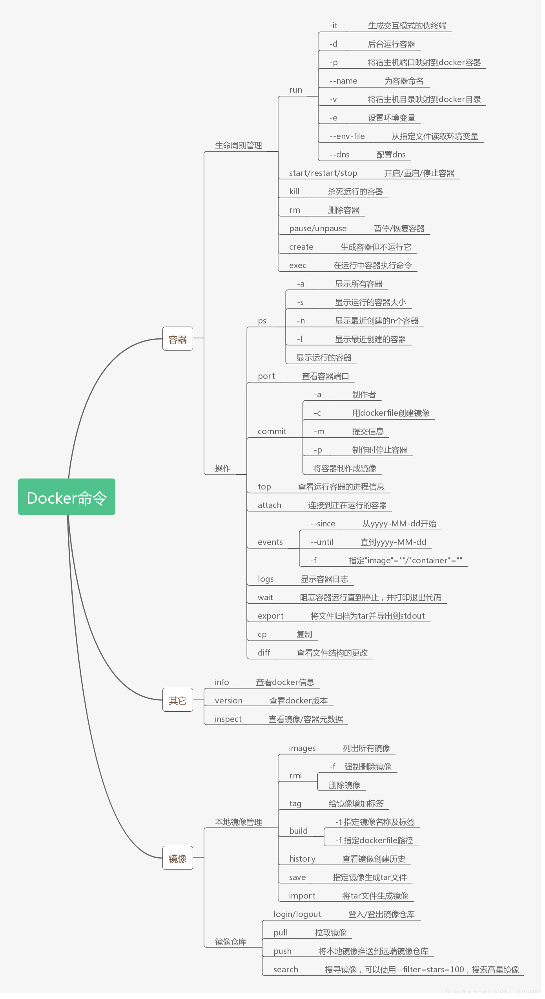
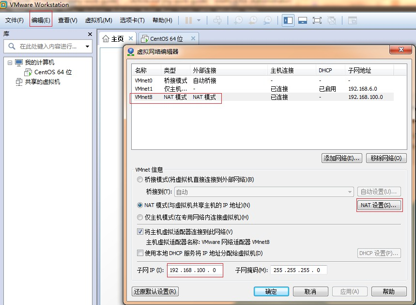
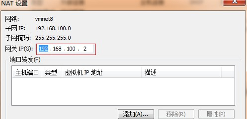
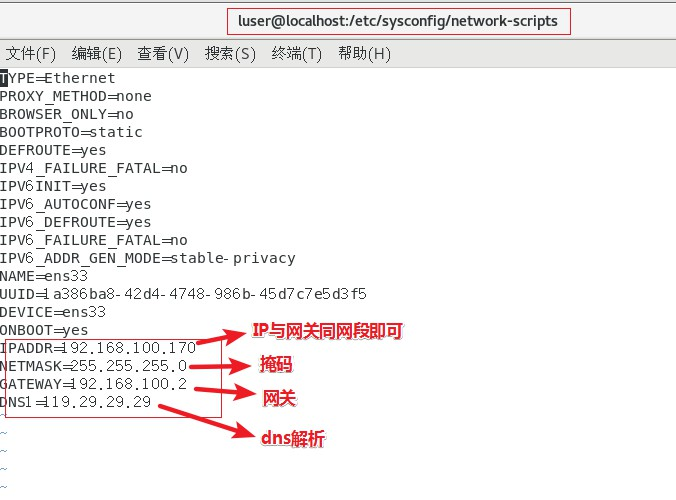

> ### 安装谷歌插件

Online-Tool  ->  在线工具  ->  Chrome插件下载  ->  下载需要的.crx文件修改为.rar或者其他压缩格式  ->  解压  ->  Chrome扩展程序打开开发者模式，加载已解压的扩展程序，选择上一步的解压文件即可。推荐： 
- Similar Sites  
- Octotree  
- SourceGraph  
- GitZip 
- OneTab  
- Momentum  
- 简悦  
- Smart PDF  
- My IP address  
- Talend API Tester  
- JSON Viewer Awesome  
- AdGuard AdBlocker  
- Extension Manager  
> ### idea插件  
 
- IDE Features Trainer  (IDEA交互式教程)  
- RestfulToolkit  (RESTful服务开发)  
- Key Promoter X  (快捷键)  
- Presentation Assistant  (快捷键展示)  
- Codota  (代码智能提示)  
- Alibaba Java Code Guidelines  (阿里巴巴Java代码规范)  
- GsonFormat+RoboPOJOGenerator  (JSON转类对象)  
- Statistic  (项目信息统计)  
- Translation  (必备的翻译插件)  
- CamelCase  (多种命名格式之间切换)  
- Grep Console  (控制台输出处理)
- Rainbow Brackets  (彩虹🌈括号)
- Save Actions  (优化保存操作)
- SequenceDiagram  (一键生成时序图)
- Maven Helper  (分析Maven项目的相关依赖)
- EasyCode  (一键帮你生成所需代码)
- CheckStyle  (代码格式检查)
- SonarLint  (帮你优化代码)
- Lombok  (帮你简化代码)
- CodeGlance  (代码微型地图)
- Java Stream Debugger  (Java8 Stream调试器)
- Git Commit Template  (使用模板创建commit信息)  
- A Search with Github  (通过 Github搜索相关代码)  
- stackoverflow  (快速跳转到 stackoverflow)  
- CodeStream  
- Code screenshots  (代码片段保存为图片)  

>### docker

- 安装docker和docker-compose  
```
安装docker
sudo yum update
curl -fsSL https://get.docker.com | bash -s docker --mirror Aliyun
sudo systemctl start docker
添加仓库
yum-config-manager \
    --add-repo \
    http://mirrors.aliyun.com/docker-ce/linux/centos/docker-ce.repo
yum-config-manager \
    --add-repo \
    https://mirrors.tuna.tsinghua.edu.cn/docker-ce/linux/centos/docker-ce.repo  
```
```
安装docker-compose
pip install docker-compose --ignore-installed requests
```
- 非root用户如何使用docker:  
1.查看是否有docker用户组  
```
  sudo cat /etc/group | grep docker  
```
2.若无则创建用户组,并将用户添加进docker用户组  
```
  sudo groupadd -g 999 docker(999为组id)  
  sudo usermod -aG docker domi  
```
3.重启docker生效  
```
  sudo service docker restart(Ubuntu系统)
  sudo systemctl restart docker(Centos系统)  
```
4.需要/var/run/docker.sock权限  
```
  sudo chmod a+rw /var/run/docker.sock  
```
- docker卸载镜像:
1.查看镜像进程:  
```
docker ps -a  
```
2.停止镜像进程:  
```
docker stop 容器id  
```
3.删除镜像进程:  
```
docker rm 容器id  
```
4.查看docker镜像:  
```
docker images  
```
5.删除docker镜像: 
``` 
docker rmi 镜像id  
```
- docker基础命令  
  

>### 配置git  

1.配置git环境  
```
git config --global user.name "你的用户名"  
git config --global user.email "你的注册邮箱"  
```
2.生成SSH秘钥  
```
ssh-keygen -C "你的注册邮箱" -t rsa  
```
3.github配置公钥  
setting填入生成的公钥(id_rsa.pub)  
4.将key加入ssh-agent  
```
ssh-add  ~/.ssh/id_rsa
```

>### centos7 

 重启ssh  
 `
 systemctl restart sshd.service
 `  
 ssh开机自启动  
 `
 systemctl enable sshd.service
 `  
 
 设置开机模式  
 `systemctl get-default(获取当前模式)`  
 `
 systemctl set-default graphical.target(multi_user.target 多用户模式)
 `  
 安装图形界面  
 `
 yum groupinstall "GNOME Desktop" "Graphical Administration Tools"
 `  
 静态IP联网设置  
 进入VMware虚拟网络编译器将子网IP改成宿主机同网段IP，取消DHCP，NET设置网关IP为子网IP同网段，如下图：
   
   
 centos7终端修改配置文件(vi /etc/sysconfig/network-scripts/ifcfg-ens33)  
   
 重启网络  
 `
 systemctl restart network
 `
 
 安装pip  
 `
 yum -y install epel-release
 `   
 `
 yum -y install python-pip
 `  
 升级pip     
 `
 pip install --upgrade pip
 `

>### 搭建gitlab

- 安装依赖关系包ssh  
 `
 yum -y install curl policycoreutils openssh-server openssh-clients postfix 
 `
- 安装防火墙并启动  
```
   yum -y install firewalld systemd
   systemctl start firewalld
```
- 添加http服务到firewalld,pemmanent表示永久生效  
```
   firewall-cmd --permanent --add-service=http
   systemctl restart firewalld
```
- 安装Postfix以发送通知邮件  
```
   yum -y install postfix 
   systemctl start postfix
   systemctl enable postfix
```
- 添加gitlab镜像  
`
wget https://mirrors.tuna.tsinghua.edu.cn/gitlab-ce/yum/el7/gitlab-ce-10.2.3-ce.0.el7.x86_64.rpm
`
- 安装gitlab  
```
   yum -y install policycoreutils-python  
   rpm -ivh gitlab-ce-10.2.3-ce.0.el7.x86_64.rpm
```
- 修改gitlab配置文件指定服务器ip和自定义端口  
`
vim /etc/gitlab/gitlab.rb
`
- 重置并启动GitLab  
```aidl
   gitlab-ctl reconfigure
   gitlab-ctl restart
```
- gitlab常用命令  
```aidl
   iptables -F 清除防火墙规则
   gitlab-ctl start 启动全部服务
   gitlab-ctl restart 重启全部服务   
   gitlab-ctl stop 停止全部服务   
   gitlab-ctl reconfigure 使配置文件生效   
   gitlab-ctl show-config 验证配置文件   
   gitlab-ctl uninstall 删除gitlab（保留数据）   
   gitlab-ctl cleanse 删除所有数据，从新开始
```
- gitlab汉化  
```aidl
   yum -y install git
   git clone https://gitlab.com/xhang/gitlab.git  克隆获取汉化版本库
   gitlab-ctl stop  先将gitlab关闭
   cd /root/gitlab  切换到gitlab汉化包所在的目录
   git diff v10.2.3 v10.2.3-zh > ../10.2.3-zh.diff  比较汉化标签和原标签，导出 patch 用的 diff 文件到/root下
   yum -y install patch  下载补丁
   patch -d /opt/gitlab/embedded/service/gitlab-rails -p1 < /root/10.2.3-zh.diff  将10.2.3-zh.diff作为补丁更新到gitlab中
   gitlab-ctl restart  启动gitlab
```
- 创建gitlab root_ssh 秘钥  
```aidl
   ssh-keygen  -t rsa
   cat /root/.ssh/id_rsa.pub
```

