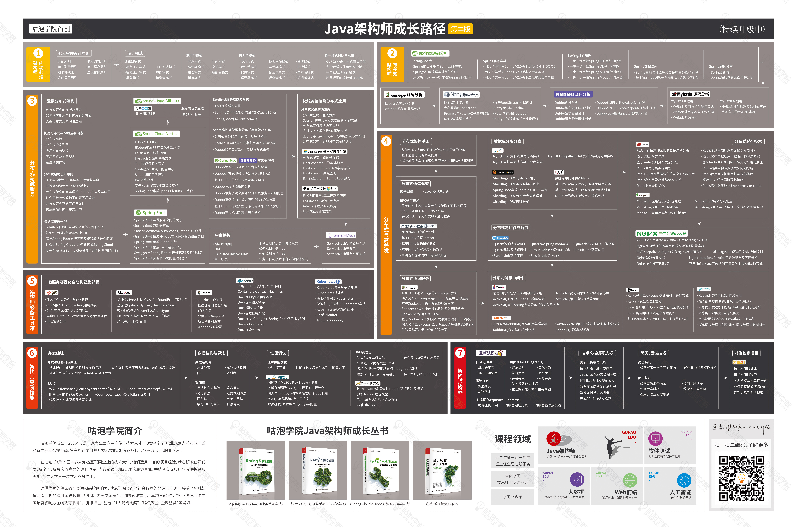

>### java面试资料
   
1.[JavaGuide](https://snailclimb.gitee.io/javaguide/#/)  
2.[CS-Notes](https://cyc2018.github.io/CS-Notes/#/)  
3.[JavaFamily](https://github.com/AobingJava/JavaFamily)
>### java开源手脚架

1.[RuoYi-Cloud](https://gitee.com/y_project/RuoYi-Cloud)  
2.[Pig](https://gitee.com/log4j/pig)  
3.[Mall-Swarm](https://github.com/macrozheng/mall-swarm)  
>### 技术文档  

1.[SpringCloud-Learning](https://github.com/macrozheng/springcloud-learning)   
2.[Vue](http://doc.vue-js.com/)  
3.[微信开发](https://developers.weixin.qq.com/doc/)  
4.[kafka](http://kafka.apachecn.org/)  
5.[k8s](https://www.kubernetes.org.cn/k8s)  
6.[mybatis](https://mp.baomidou.com/)  
7.[layui](https://www.layui.com/doc/)  
8.[es](https://www.elastic.co/guide/cn/elasticsearch/guide/current/index.html)  
9.[nacos](http://dubbo.apache.org/zh-cn/docs/user/references/registry/nacos.html)  
10.[element-ui](https://element.eleme.cn/#/zh-CN)   
11.[docker中文社区](https://www.docker.org.cn/)  
12.[springcloud全家桶中文网](https://www.springcloud.cc/)    
13.[dubbo](http://dubbo.apache.org/zh-cn/docs/user/quick-start.html)

>### java技术图  

  